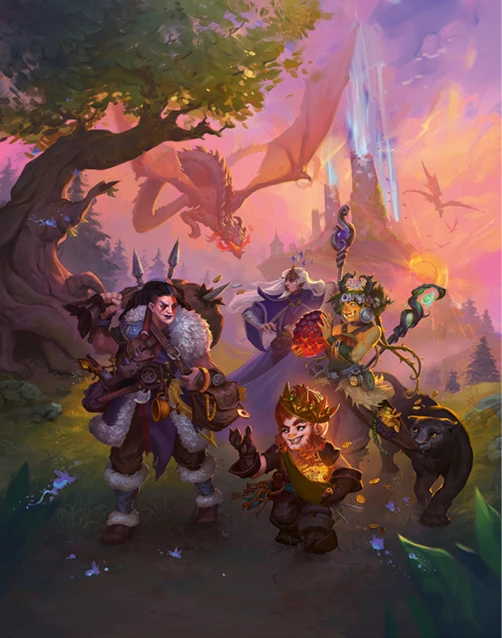

<h2>Module <em>Chroniques Oubliées Fantasy - Livre des règles</em> pour Foundry Virtual TableTop</h2>

  

Ce module contient tous les éléments présents dans le pdf officiel Livre des Règles, adapté à Foundry VTT

    
     
    
     

<h2>Contributeurs</h2>
<ul>
<li>Ce module a été réalisé par Kristov</li>
<li>Avec la participation de Caloup et l'Alchimiste.</li>
</ul>

<h2>Mentions Légales</h2>
© Black Book Éditions, 2025. Chroniques Oubliées Fantasy est une marque déposée par Black Book Éditions. Tous droits réservés.
Le texte et les images sont la propriété de Black Book Éditions.

<h2>Communauté</h2>

Rejoignez-nous sur le serveur <a href="https://discord.com/invite/pPSDNJk">Discord francophone dédié à Foundry Virtual Tabletop</a>

Nous serons ravis d'avoir vos retours sur le module, des signalements de bug, des idées d'amélioration, ou simplement des encouragements !

<h2>Licences</h2>
<ul>
<li>Le code HTML, CSS et Javascript de ce projet est placé sous <a href="https://choosealicense.com/licenses/gpl-3.0/">licence GNU General Public License v3.0</a></li>

<li>Le support de Foundry VTT est couvert par la licence suivante : <a href="https://foundryvtt.com/article/license/">Accord de licence limitée pour le développement de modules du 17/02/2021</a>.</li>
</ul>
